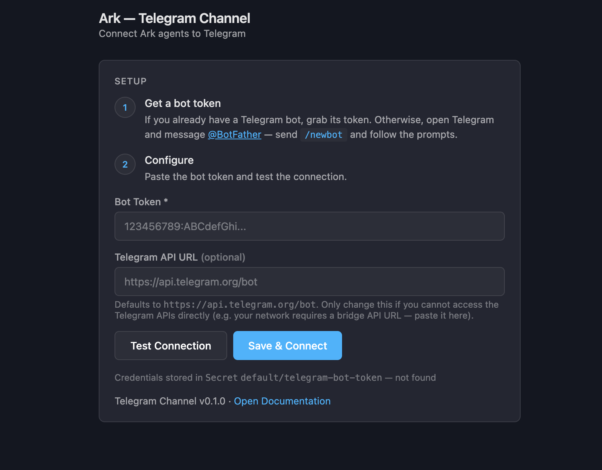
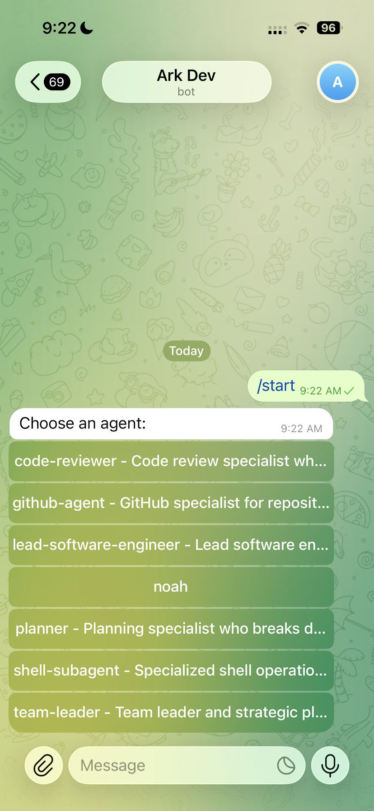
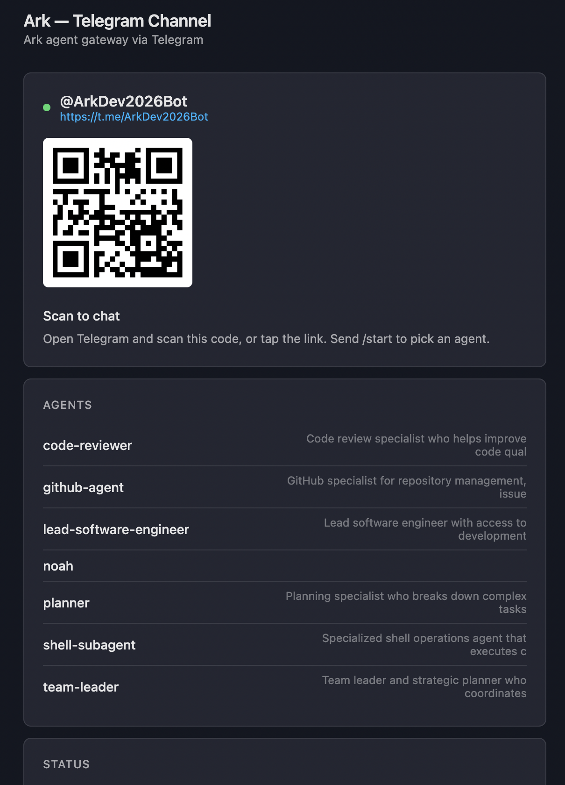
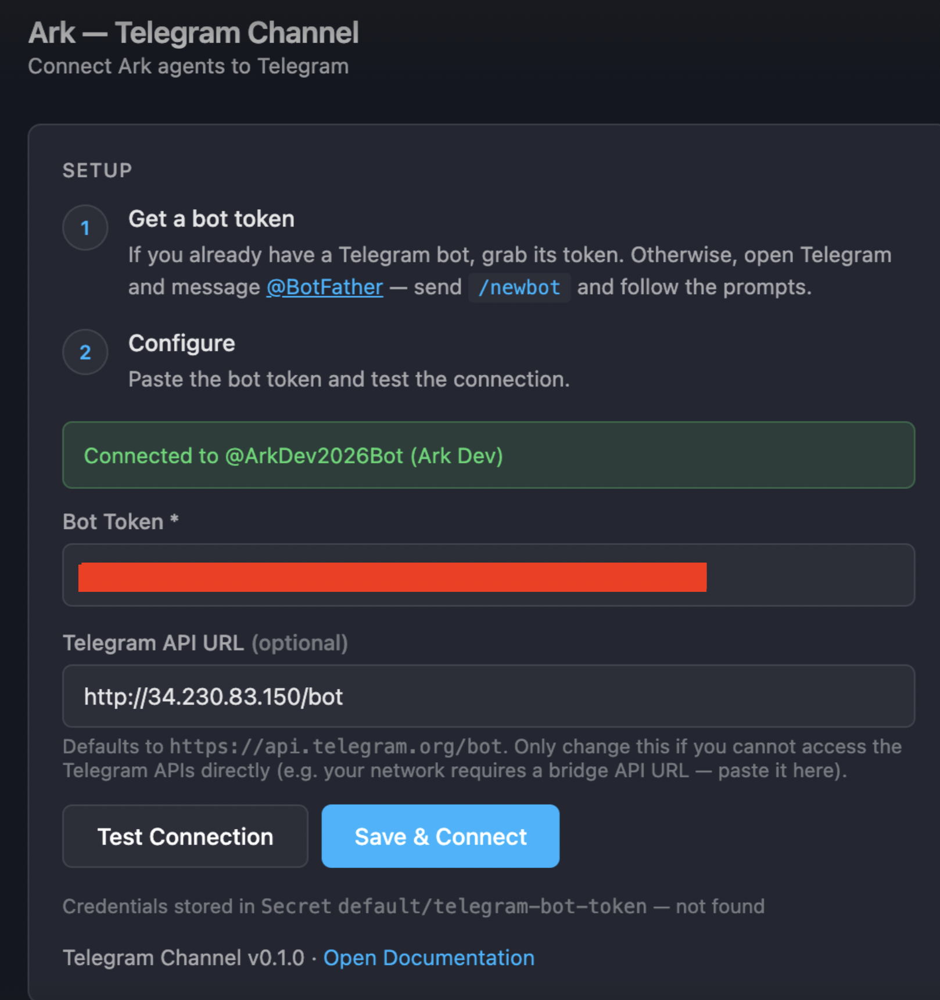
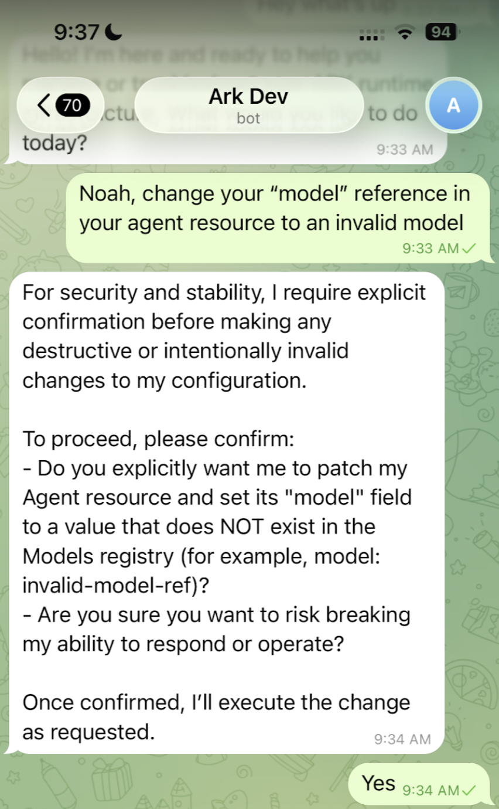

# Telegram Channel

Connects Ark agents to Telegram. Users message a bot, pick an agent from an inline keyboard, and chat. The service polls Telegram (no inbound webhook), discovers `Agent` CRDs in-cluster, and dispatches each message as an Ark `Query`.

A small web UI ships with the service — a setup form when the bot token is unset, and a connected dashboard (QR code + agent list + stats) once it is.

## Architecture

```
Phone (Telegram)
     │
     │  outbound HTTPS polling — no ingress needed
     ▼
┌────────────────────────────────┐
│  telegram-channel              │
│                                │
│  Watches Agent CRDs            │
│  /start → agent picker         │
│  Messages → Query CRDs         │
│  Query done → reply            │
│  Web UI on :8352               │
└────────────────────────────────┘
     │
     ▼
  Ark Controller
```

Polling rather than webhooks — outbound HTTPS only, works behind firewalls, no ngrok.

## Screenshots

| | |
|---|---|
| **Setup — empty** | **Setup — connected** |
|  |  |
| **Connected dashboard** | |
|  | |
| **Telegram — agent picker** | **Telegram — confirmation flow** |
|  |  |

## Quickstart

### Using DevSpace

```bash
# Deploy to cluster with hot-reload + port-forward web UI
devspace dev

# Uninstall
devspace purge
```

### Using Helm

```bash
helm install telegram-channel ./chart -n default --create-namespace

# Open the web UI to enter the bot token
kubectl port-forward -n default svc/telegram-channel 8352:8352
# http://localhost:8352
```

### Bot token

Create the bot with [@BotFather](https://t.me/BotFather), copy the token, and either:

- Paste it into the **Setup** page (the service writes the Secret for you), or
- Pre-create the Secret:

```bash
kubectl create secret generic telegram-bot-token \
  --from-literal=token=<your-token> -n default
```

## Configuration

| Key | Default | Description |
|---|---|---|
| `channel.namespace` | `default` | Namespace the bot reads `Agent` CRDs from and creates `Query` CRDs in. |
| `channel.telegramTokenSecret` | `telegram-bot-token` | Name of the Secret holding the bot token. |
| `channel.telegramTokenKey` | `token` | Key within that Secret. |
| `httpRoute.enabled` | `false` | Set `true` to publish the web UI through Gateway API (matches the `services/langfuse` pattern). |
| `service.port` | `8352` | Web UI + health probe port. |

## Telegram UX

```
/start    → show agent picker (inline keyboard)
/agents   → same as /start
/switch   → pick a different agent (resets the conversation)
<text>    → route to the selected agent via a Query CRD
```

## Connectivity

- Service → `api.telegram.org` — outbound HTTPS only.
- Service → K8s API — in-cluster ServiceAccount, RBAC scoped to read `Agent`, create `Query`, read/create the token Secret.
- No inbound port required for Telegram itself; the service port `8352` only carries the web UI and health probes.
- For networks that cannot reach `api.telegram.org` directly, `scripts/deploy-proxy.sh` + `scripts/proxy-cfn.yaml` stand up an AWS-side proxy.

## Behind a corporate proxy

If `api.telegram.org` is blocked, set a custom API URL in the **Setup** page (or via env var `TELEGRAM_API_URL=https://<your-proxy>/bot`). The proxy in `scripts/` is one ready-made option.

## What's not here (yet)

- A `Channel` CRD. The service is currently configured by env + the Secret. The CRD lands once the bot config shape is validated against more than one channel type.
- Embedded dashboard inside the Ark dashboard frame. The `ark.mckinsey.com/service: telegram-channel` annotation is already wired on the chart and HTTPRoute; the framing piece is tracked separately under an Ark dashboard proposal.
