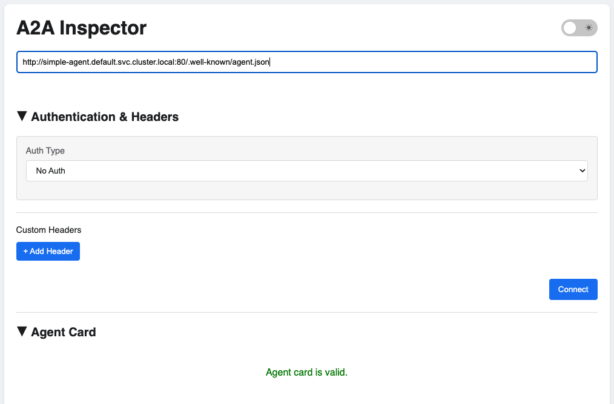

# A2A Inspector

Debug and test A2A (Agent2Agent) protocol agents in Kubernetes.



## Install

```bash
ark install marketplace/services/a2a-inspector
```

Or with DevSpace:

```bash
cd services/a2a-inspector
devspace dev
```

Access via:
- http://a2a-inspector.default.127.0.0.1.nip.io:8080
- Port forward: `kubectl port-forward svc/a2a-inspector 8080:8080`
- Ark Dashboard → Services page

## Usage

1. Connect to an A2A agent by entering its URL (e.g., `http://localhost:5555`)

2. View the agent card and perform specification compliance checks

3. Use the live chat interface to interact with the agent

4. Open the debug console to view raw JSON-RPC 2.0 messages

## Features

- **Agent Card Viewer**: Automatically fetches and displays agent information
- **Spec Compliance**: Validates agents against A2A specification
- **Live Chat**: Interactive messaging with connected agents
- **Debug Console**: View raw protocol messages for debugging

## Uninstall

**Using DevSpace:**
```bash
cd services/a2a-inspector
devspace purge
```

**Using Helm:**
```bash
helm uninstall a2a-inspector -n default
```

## Additional Resources

- [A2A Inspector GitHub](https://github.com/a2aproject/a2a-inspector)
- [A2A Protocol](https://a2a.google)
