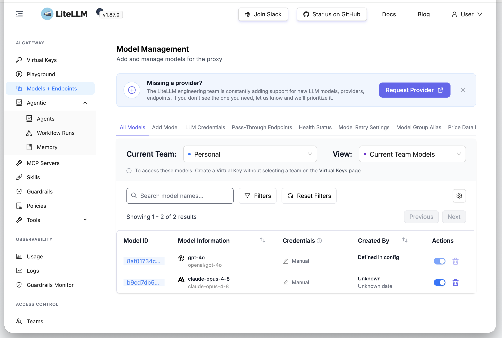
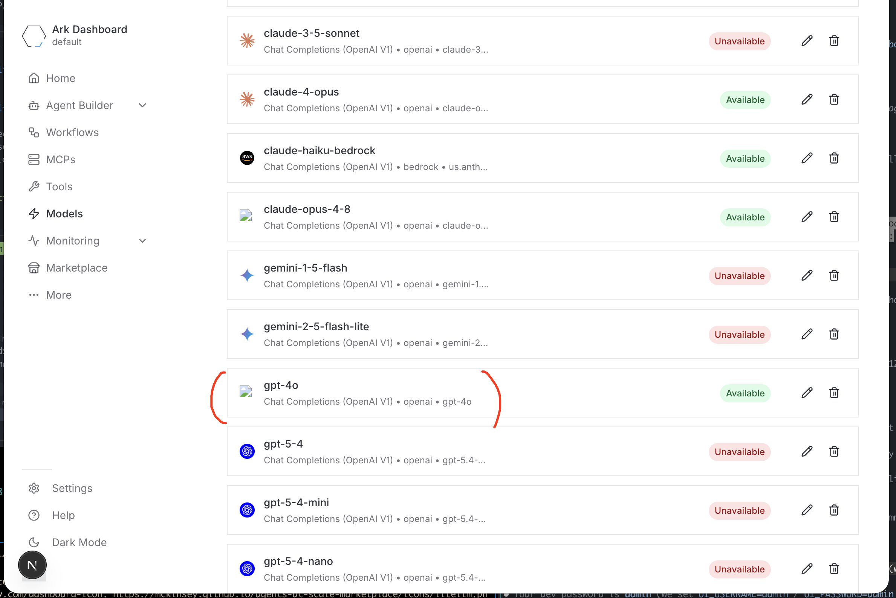
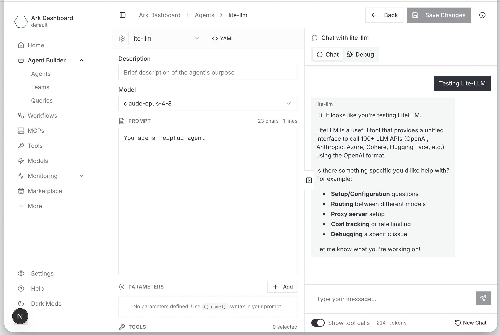

# LiteLLM

OpenAI-compatible proxy deployed to `ark-system`. Holds all provider keys
centrally — tenants get scoped virtual keys and never see provider secrets.

```
provider keys (ark-system) → LiteLLM :4000 → OpenAI / Azure / Anthropic / Bedrock
tenant → scoped virtual key → /v1/chat/completions
```

A bundled **model provider** syncs `Model` resources and per-tenant keys into
tenant namespaces, so tenants see models and run queries without holding provider
credentials.

## Install

```bash
ark install marketplace/services/litellm
```

Or with DevSpace:

```bash
cd services/litellm
devspace dev
```

Add provider keys (a Secret in `ark-system`):

```bash
kubectl create secret generic litellm-provider-secrets -n ark-system \
  --from-literal=OPENAI_API_KEY=sk-...
```

Set which tenant namespaces receive models via `modelProvider.targets`.

## Configure a model

Open the dashboard (`admin` / `admin`):

- http://litellm.ark-system.127.0.0.1.nip.io:8080/ui
- Port forward: `kubectl port-forward -n ark-system svc/litellm 4000:4000` → `/ui`

**Models + Endpoints → Add Model** → OpenAI · `gpt-4o` · paste key → **Add**.



## Use it from a tenant

The model provider syncs the model into your tenant namespace:

```bash
kubectl get models -n tenant-a
```



Run a query:

```yaml
apiVersion: ark.mckinsey.com/v1alpha1
kind: Agent
metadata: { name: assistant, namespace: tenant-a }
spec: { modelRef: { name: gpt-4o }, prompt: You are a helpful assistant. }
---
apiVersion: ark.mckinsey.com/v1alpha1
kind: Query
metadata: { name: hello, namespace: tenant-a }
spec: { target: { type: agent, name: assistant }, input: Say hello. }
```



The call routes `Query → ark-completions → LiteLLM → OpenAI`. The provider key
never leaves `ark-system`.

## Model provider

Reconciles `Model` resources and scoped virtual keys into the namespaces listed in
`modelProvider.targets`. Add a model in LiteLLM and it appears in entitled
tenants; remove it and it's pruned. A per-target `models` list scopes a tenant to
a subset (omit for all models). Tenant keys are scoped virtual keys — not the
master key — and are centrally revocable.

## Configuration

| Value | Default | Purpose |
|-------|---------|---------|
| `masterKey` | `sk-1234` | Master key (weak dev default — change for prod). |
| `litellm-helm.envVars.UI_USERNAME` / `UI_PASSWORD` | `admin` / `admin` | Dashboard login (change for prod). |
| `modelProvider.targets` | `[{namespace: default}]` | Namespaces to sync. |
| `httpRoute.enabled` | `false` | Expose the dashboard via Gateway API. |

## Troubleshooting

| Symptom | Fix |
|---------|-----|
| `/key/generate` 500, `TableNotFound` | Migration raced Postgres; the chart gates it with an init container — restart once Postgres is up. |
| Model `AVAILABLE=False`, "token not in VerificationTokenTable" | Stale key after a DB reset. `kubectl delete secret litellm-vkey -n <ns>` to re-mint; use persistent Postgres. |
| Query 401 `Incorrect API key sk-dummy` | Set a real key in `litellm-provider-secrets`, then `kubectl rollout restart deploy/litellm -n ark-system`. |
| Tenant pod reaches the proxy directly | NetworkPolicy needs an enforcing CNI (Calico/Cilium). |

## Uninstall

```bash
cd services/litellm
devspace purge          # or: helm uninstall litellm -n ark-system
```

Generated Models and keys aren't auto-removed (cross-namespace GC). Clean up by
label:

```bash
kubectl delete models,secrets -A -l app.kubernetes.io/managed-by=litellm-model-provider
```

## Additional Resources

- [LiteLLM docs](https://docs.litellm.ai/)
- [Virtual keys](https://docs.litellm.ai/docs/proxy/virtual_keys)
