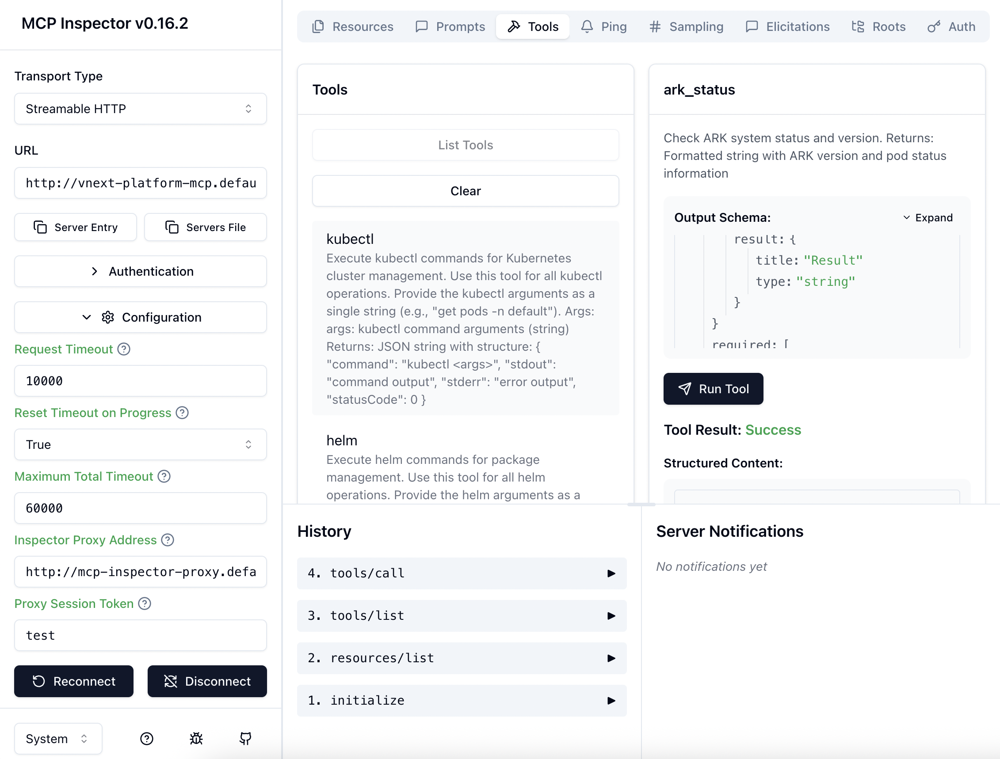

# MCP Inspector

Debug and test MCP servers in Kubernetes.



## Install

```bash
ark install marketplace/services/mcp-inspector
```

Or with DevSpace:

```bash
cd services/mcp-inspector
devspace dev
```

Access: http://mcp-inspector.default.127.0.0.1.nip.io:8080

## Usage

1. Find your MCP server address:
   ```bash
   kubectl get mcpserver -A
   ```

2. In the inspector UI, go to **Configuration** and set **Proxy Session Token** to any value (e.g., `test`)

3. Enter the MCP server address and connect

## Uninstall

**Using DevSpace:**
```bash
cd services/mcp-inspector
devspace purge
```

**Using Helm:**
```bash
helm uninstall mcp-inspector -n default
```

## Additional Resources

- [MCP Inspector GitHub](https://github.com/modelcontextprotocol/inspector)
- [Model Context Protocol](https://modelcontextprotocol.io/)
